# Layer-wise Semantic Dynamics: Complete Documentation
## From Beginner to Advanced - Understanding Hallucination Detection in LLMs

---

# PART 1: FOUNDATIONS
## Understanding the Core Concepts

### 1.1 What is Layer-wise Semantic Dynamics?

Imagine you're reading a book, and with each page, your understanding of the story evolves. Similarly, when a Large Language Model (LLM) processes text, its "understanding" evolves as the information flows through its neural network layers. **Layer-wise Semantic Dynamics** is the study of how this understanding changes from the input layer to the output layer.

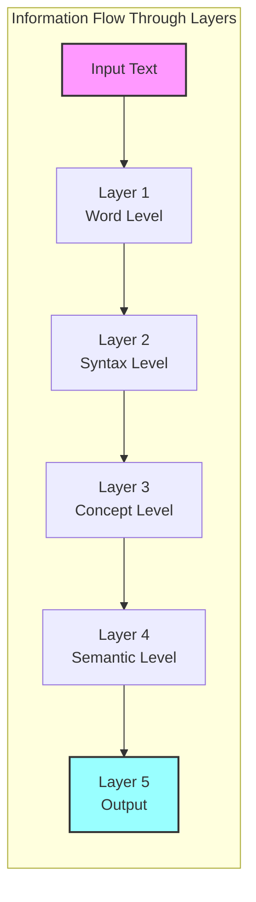

### 1.2 Why Does This Matter for Hallucination Detection?

**Hallucinations** in LLMs occur when the model generates factually incorrect information while sounding confident. For example:
- **Correct**: "The Eiffel Tower is in Paris, France"
- **Hallucination**: "The Eiffel Tower is in Rome, Italy"

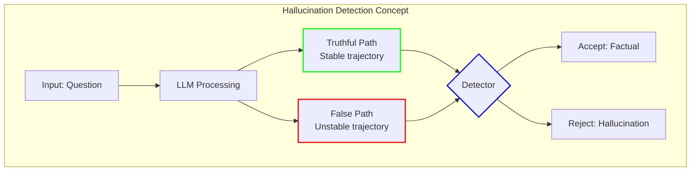

### 1.3 The Core Idea in Simple Terms

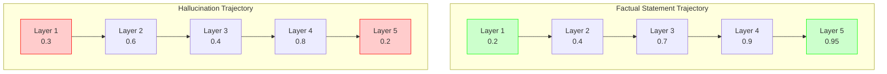

---

# PART 2: SYSTEM ARCHITECTURE

## 2.1 High-Level Architecture

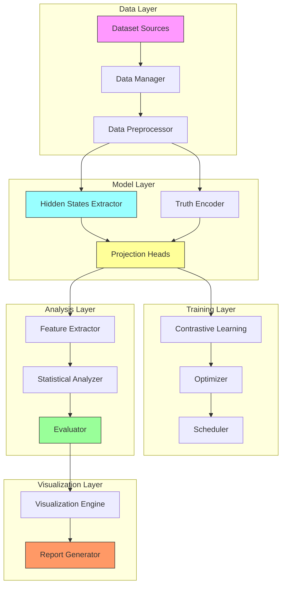

## 2.2 Class Diagram

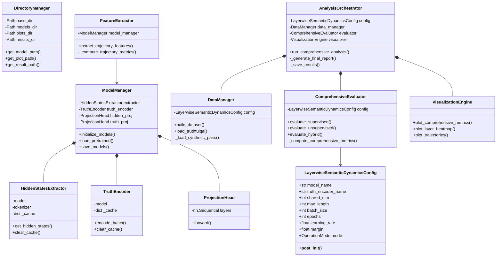

## 2.3 Data Flow Diagram

```mermaid
graph LR
    subgraph "Input"
        T[Text]
        G[Ground Truth]
        L[Label]
    end
    
    subgraph "Processing Pipeline"
        T --> HE[Hidden States Extractor]
        G --> TE[Truth Encoder]
        
        HE --> HS[Hidden States<br/>[batch, layers, dim]]
        TE --> TE2[Truth Embeddings<br/>[batch, truth_dim]]
        
        HS --> HP[Hidden Projection<br/>[batch, shared_dim]]
        TE2 --> TP[Truth Projection<br/>[batch, shared_dim]]
        
        HP --> CS[Cosine Similarity<br/>[batch]]
        TP --> CS
    end
    
    subgraph "Output"
        CS --> LOSS[Contrastive Loss]
        CS --> AL[Alignment Scores]
        AL --> FEAT[Trajectory Features]
    end
    
    style T fill:#f9f
    style G fill:#9ff
    style LOSS fill:#ff9
    style FEAT fill:#9f9
```

---

# PART 3: COMPONENT DETAILS

## 3.1 HiddenStatesExtractor - The "Eyes" of the System

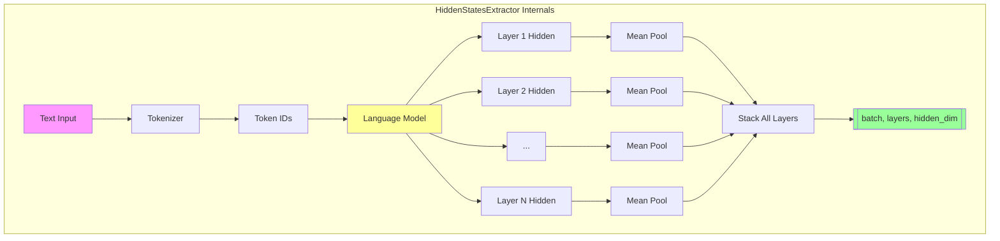

### Code Structure:
```python
class HiddenStatesExtractor:
    """
    Extracts hidden states from all layers of a language model.
    """
    
    def __init__(self, model_name: str, device: str, max_length: int):
        # Load model and tokenizer
        # Initialize cache
        pass
    
    def get_hidden_states(self, texts: List[str]) -> torch.Tensor:
        """
        Returns: Tensor of shape [batch_size, num_layers, hidden_size]
        
        Process:
        1. Tokenize texts
        2. Forward pass through model
        3. Extract all layer hidden states
        4. Mean pool each layer
        5. Stack results
        """
        pass
```

## 3.2 TruthEncoder - The "Oracle"

```mermaid
graph LR
    subgraph "TruthEncoder Workflow"
        T[Truth Statement] --> ST[Sentence Transformer]
        ST --> E1[Raw Embedding<br/>[384] for MiniLM]
        E1 --> Norm[L2 Normalization]
        Norm --> E2[Normalized Embedding<br/>||v|| = 1]
        
        T2[Similar Truth] --> ST2[Sentence Transformer]
        ST2 --> E12[Raw Embedding]
        E12 --> Norm2[L2 Normalization]
        Norm2 --> E22[Normalized Embedding]
        
        E2 --> CS{Cosine Similarity}
        E22 --> CS
        
        CS --> SIM[Similarity Score<br/>Close to 1.0]
    end
    
    style T fill:#f9f
    style T2 fill:#9ff
    style SIM fill:#9f9
```

## 3.3 Projection Heads - The "Translators"


## 3.4 Contrastive Learning Architecture

```mermaid
graph TD
    subgraph "Training Batch"
        B[Batch of 8 pairs] --> HP[Positive Pairs<br/>Factual]
        B --> HN[Negative Pairs<br/>Hallucination]
    end
    
    subgraph "Shared Space Projection"
        HP --> HPP[Projected Hidden]
        HP --> TPP[Projected Truth]
        HN --> HPN[Projected Hidden]
        HN --> TPN[Projected Truth]
    end
    
    subgraph "Similarity Computation"
        HPP --> CSP[Cosine Similarity<br/>Target: ~1.0]
        TPP --> CSP
        
        HPN --> CSN[Cosine Similarity<br/>Target: ≤ -margin]
        TPN --> CSN
    end
    
    subgraph "Loss Calculation"
        CSP --> POSLOSS[Positive Loss<br/>(1 - sim)²]
        CSN --> NEGLOSS[Negative Loss<br/>ReLU(sim + margin)²]
        
        POSLOSS --> LOSS[Total Loss<br/>0.5*pos + 0.5*neg]
        NEGLOSS --> LOSS
    end
    
    style HP fill:#cfc
    style HN fill:#fcc
    style LOSS fill:#ff9
```

---

# PART 4: TRAINING PROCESS

## 4.1 Training Loop Sequence Diagram

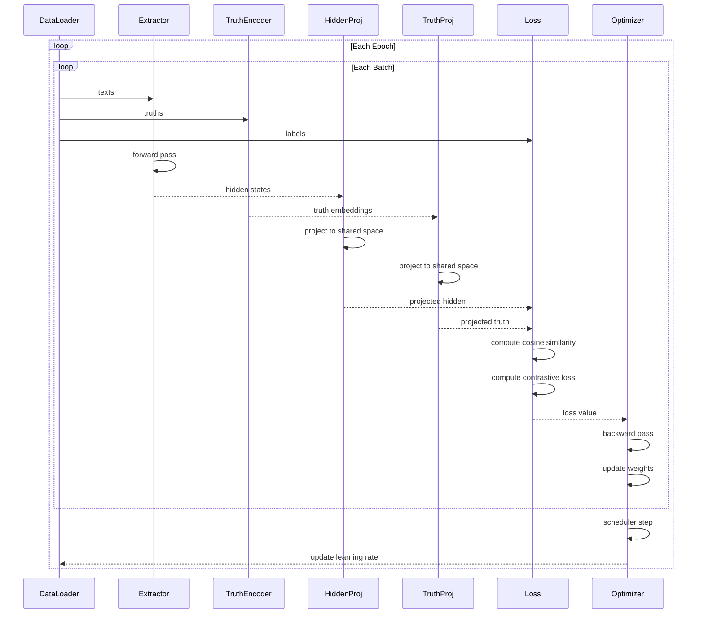

## 4.2 Training State Machine

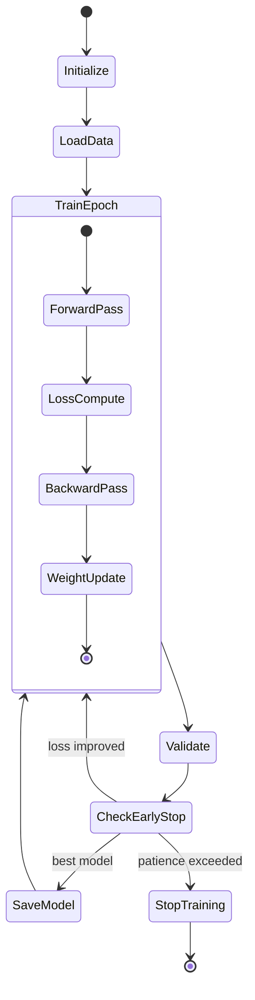

## 4.3 Gradient Flow Visualization

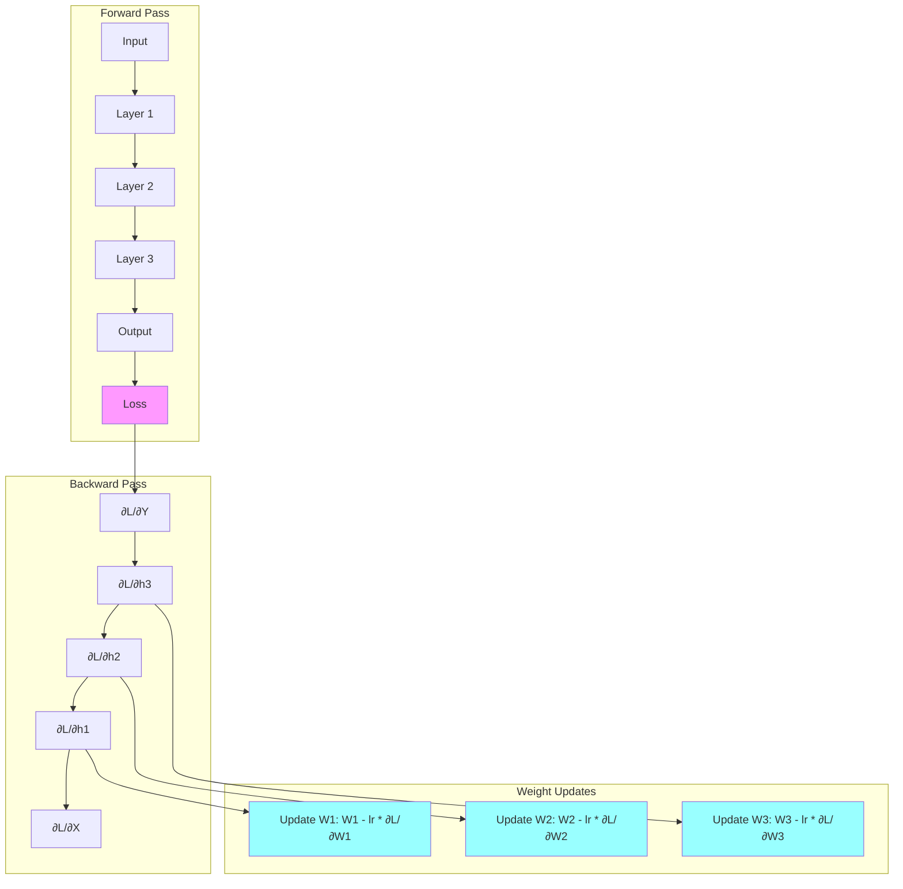

---

# PART 5: FEATURE ENGINEERING

## 5.1 Trajectory Feature Extraction

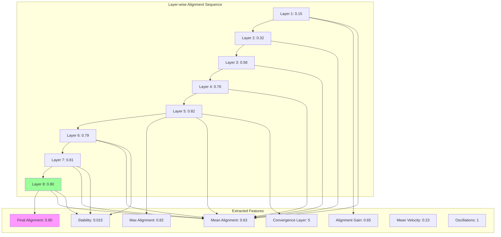

## 5.2 Feature Relationships

```mermaid
graph LR
    subgraph "Raw Data"
        HS[Hidden States<br/>[layers, dim]]
    end
    
    subgraph "Intermediate"
        AL[Alignment Scores<br/>[layers]]
        V[Velocities<br/>[layers-1]]
        ACC[Accelerations<br/>[layers-2]]
    end
    
    subgraph "Features"
        FA[Final Alignment]
        MA[Mean Alignment]
        MXA[Max Alignment]
        CL[Convergence Layer]
        ST[Stability]
        AG[Alignment Gain]
        MV[Mean Velocity]
        OC[Oscillation Count]
    end
    
    HS --> AL
    HS --> V
    V --> ACC
    
    AL --> FA
    AL --> MA
    AL --> MXA
    AL --> CL
    AL --> ST
    AL --> AG
    AL --> OC
    
    V --> MV
    
    style HS fill:#f9f
    style FA fill:#9f9
    style MV fill:#9f9
```

---

# PART 6: EVALUATION PIPELINE

## 6.1 Evaluation Flow

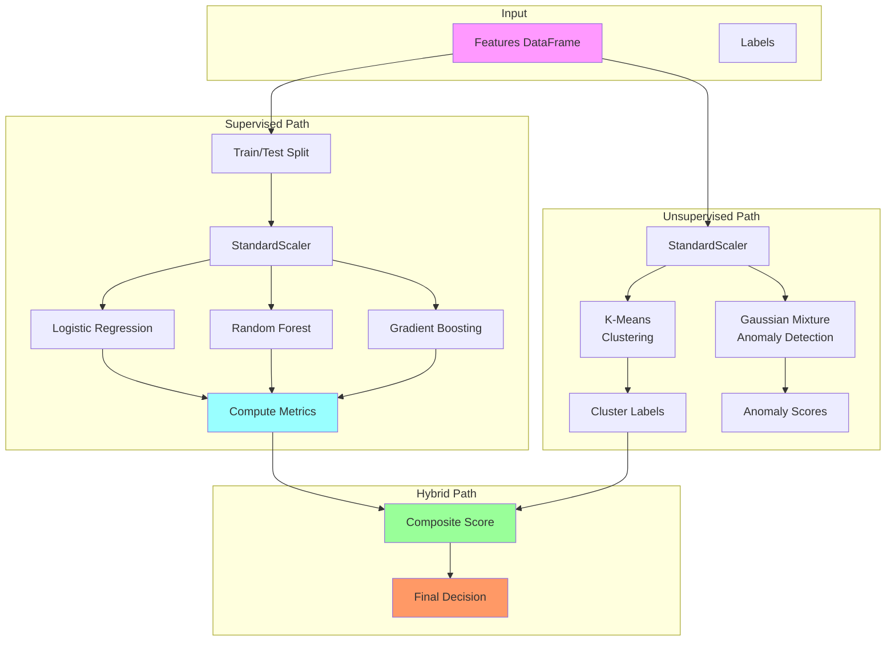

## 6.2 Metric Computation Diagram

```mermaid
graph TD
    subgraph "Confusion Matrix"
        TP[True Positives]
        TN[True Negatives]
        FP[False Positives]
        FN[False Negatives]
    end
    
    subgraph "Basic Metrics"
        TP --> P[Precision = TP/(TP+FP)]
        TN --> S[Specificity = TN/(TN+FP)]
        TP --> R[Recall = TP/(TP+FN)]
        
        P --> F1[F1 = 2PR/(P+R)]
        R --> F1
    end
    
    subgraph "Advanced Metrics"
        Y[True Labels] --> ROC[AUC-ROC]
        YP[Predictions] --> ROC
        
        Y --> PR[AUC-PR]
        YP --> PR
        
        TP --> MCC[MCC]
        TN --> MCC
        FP --> MCC
        FN --> MCC
        
        Y --> K[Cohen's Kappa]
        YP --> K
    end
    
    style TP fill:#cfc
    style TN fill:#cfc
    style FP fill:#fcc
    style FN fill:#fcc
    style F1 fill:#ff9
    style ROC fill:#9ff
```

---

# PART 7: STATISTICAL ANALYSIS

## 7.1 Hypothesis Testing Flow

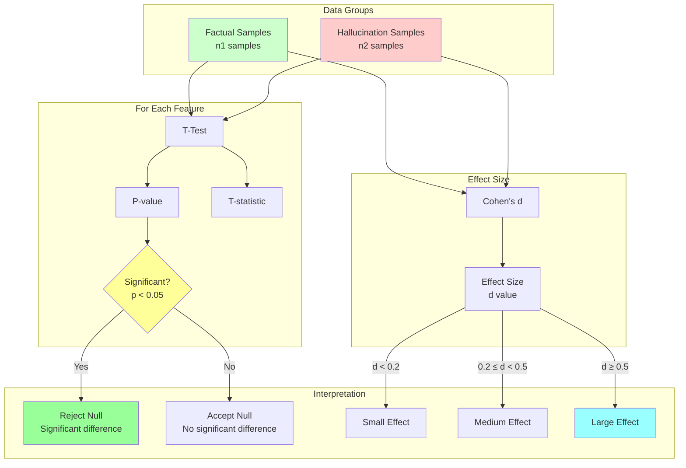

## 7.2 Feature Distribution Analysis

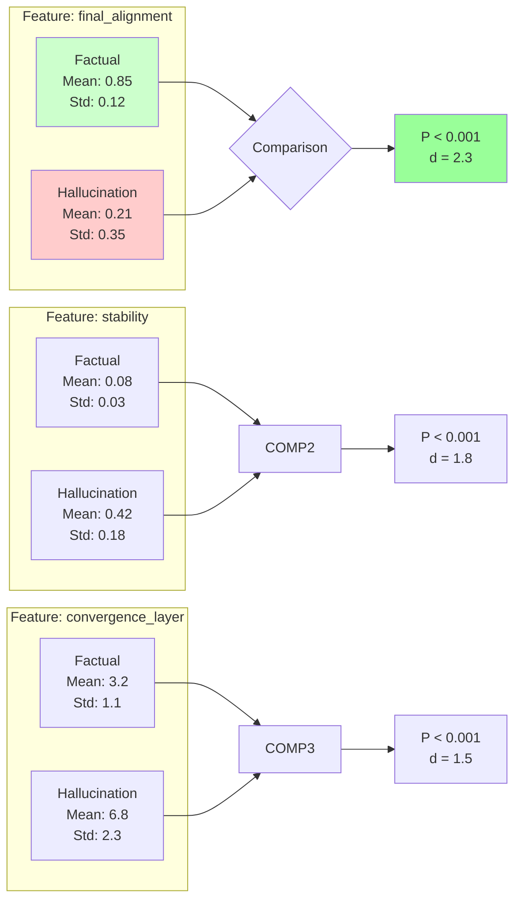

---

# PART 8: DEPLOYMENT ARCHITECTURE

## 8.1 Production System Design

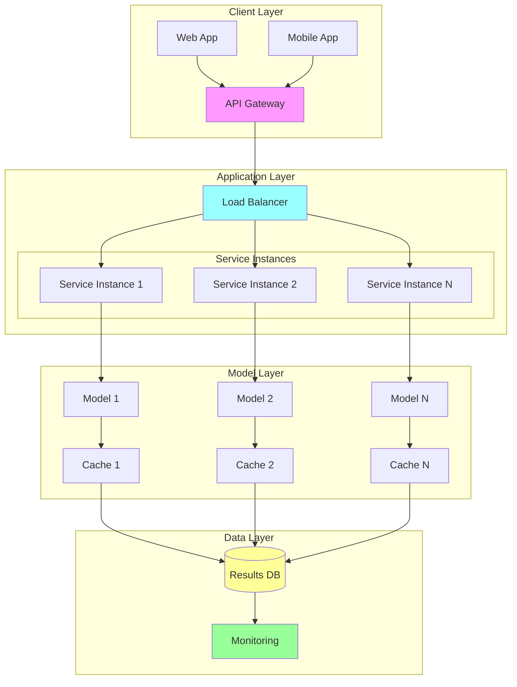

## 8.2 API Request Flow

```mermaid
sequenceDiagram
    participant C as Client
    participant G as API Gateway
    participant L as Load Balancer
    participant S as Service
    participant M as Model
    participant D as Database
    
    C->>G: POST /detect
    G->>L: Route request
    L->>S: Forward to instance
    
    S->>S: Validate input
    S->>M: Load model
    
    M->>M: Extract features
    M->>M: Run inference
    
    M-->>S: Prediction result
    
    S->>D: Log prediction
    D-->>S: Confirm
    
    S-->>L: Return response
    L-->>G: Forward response
    G-->>C: JSON result
    
    Note over C,G: Response time < 200ms
```

## 8.3 Monitoring Architecture

```mermaid
graph TD
    subgraph "Data Sources"
        API[API Logs]
        MOD[Model Predictions]
        SYS[System Metrics]
    end
    
    subgraph "Collection"
        API --> COL[Collector]
        MOD --> COL
        SYS --> COL
        
        COL --> TS[Time Series DB]
        COL --> EL[Elasticsearch]
    end
    
    subgraph "Analysis"
        TS --> PRO[Prometheus]
        EL --> KIB[Kibana]
        
        PRO --> AL[Alert Manager]
        KIB --> DASH[Dashboards]
    end
    
    subgraph "Actions"
        AL --> EMAIL[Email Alert]
        AL --> SLACK[Slack Notification]
        AL --> PAGER[Pager Duty]
        
        DASH --> GRAF[Grafana]
    end
    
    style API fill:#f9f
    style TS fill:#9ff
    style AL fill:#f96
    style GRAF fill:#9f9
```

---

# PART 9: COMPONENT INTERACTIONS

## 9.1 Complete System Interaction Diagram

```mermaid
graph TB
    subgraph "Configuration"
        C[Config Object]
        CM[Directory Manager]
        LG[Logger]
    end
    
    subgraph "Data Management"
        DM[Data Manager] --> DB[(Dataset)]
        DB --> P1[Synthetic Data]
        DB --> P2[TruthfulQA]
        DB --> P3[Custom Data]
    end
    
    subgraph "Model Management"
        MM[Model Manager]
        MM --> HE[Hidden Extractor]
        MM --> TE[Truth Encoder]
        MM --> HP[Hidden Projector]
        MM --> TP[Truth Projector]
    end
    
    subgraph "Training"
        TR[Trainer] --> MM
        TR --> DL[DataLoader]
        TR --> OP[Optimizer]
        TR --> SC[Scheduler]
    end
    
    subgraph "Analysis"
        FE[Feature Extractor] --> MM
        SA[Statistical Analyzer] --> FE
        EV[Evaluator] --> SA
    end
    
    subgraph "Output"
        EV --> VI[Visualizer]
        EV --> RP[Report Generator]
        VI --> PL[Plots]
        RP --> RJ[Results JSON]
    end
    
    C --> DM
    C --> MM
    C --> TR
    C --> EV
    
    DM --> TR
    TR --> EV
    EV --> RP
    
    style C fill:#f9f
    style MM fill:#9ff
    style TR fill:#ff9
    style EV fill:#9f9
    style RP fill:#f96
```

## 9.2 State Transition Diagram

```mermaid
stateDiagram-v2
    [*] --> Initializing
    
    Initializing --> LoadingData: Config loaded
    LoadingData --> Training: Data ready
    
    Training --> ExtractingFeatures: Model trained
    ExtractingFeatures --> StatisticalAnalysis: Features extracted
    
    StatisticalAnalysis --> Evaluating: Statistics computed
    Evaluating --> Visualizing: Evaluation complete
    
    Visualizing --> GeneratingReport: Plots created
    GeneratingReport --> [*]: Report saved
    
    Training --> EarlyStopping: No improvement
    EarlyStopping --> ExtractingFeatures: Stop training
    
    Evaluating --> Retraining: Poor performance
    Retraining --> Training: Adjust config
```

---

# PART 10: DATA STRUCTURES

## 10.1 Core Data Structures

```mermaid
classDiagram
    class TextPair {
        +str text
        +str truth
        +str label
        +int idx
        +to_dict()
    }
    
    class Batch {
        +List~TextPair~ pairs
        +List~str~ texts
        +List~str~ truths
        +torch.Tensor labels
        +to_device()
    }
    
    class HiddenStates {
        +torch.Tensor states
        +int batch_size
        +int num_layers
        +int hidden_dim
        +mean_pool()
        +layer_at(idx)
    }
    
    class TrajectoryFeatures {
        +float final_alignment
        +float mean_alignment
        +float max_alignment
        +int convergence_layer
        +float stability
        +float alignment_gain
        +float mean_velocity
        +float mean_acceleration
        +int oscillation_count
        +to_dict()
        +to_array()
    }
    
    class EvaluationMetrics {
        +float precision
        +float recall
        +float f1
        +float accuracy
        +float auroc
        +float prauc
        +float mcc
        +dict confusion_matrix
        +to_json()
    }
    
    Batch *-- TextPair
    HiddenStates --> TrajectoryFeatures
    TrajectoryFeatures --> EvaluationMetrics
```

## 10.2 JSON Schema

```json
{
  "final_report": {
    "type": "object",
    "properties": {
      "execution_summary": {
        "type": "object",
        "properties": {
          "timestamp": {"type": "string"},
          "config": {"type": "object"},
          "device": {"type": "string"},
          "total_samples": {"type": "integer"}
        }
      },
      "dataset_statistics": {
        "type": "object",
        "properties": {
          "factual_samples": {"type": "integer"},
          "hallucination_samples": {"type": "integer"},
          "class_balance": {"type": "number"}
        }
      },
      "evaluation_results": {
        "type": "object",
        "properties": {
          "LogisticRegression": {"type": "object"},
          "RandomForest": {"type": "object"},
          "GradientBoosting": {"type": "object"}
        }
      },
      "key_findings": {
        "type": "object",
        "properties": {
          "best_method": {"type": "string"},
          "best_composite_score": {"type": "number"},
          "detection_quality": {"type": "string"},
          "significant_metrics": {"type": "integer"}
        }
      },
      "recommendations": {
        "type": "array",
        "items": {"type": "string"}
      }
    }
  }
}
```

---

# PART 11: ALGORITHM FLOWCHARTS

## 11.1 Contrastive Learning Algorithm

```mermaid
flowchart TD
    Start([Start Training]) --> Init[Initialize Models]
    Init --> Load[Load Batch]
    
    Load --> Extract[Extract Hidden States]
    Extract --> Encode[Encode Truths]
    
    Encode --> Project[Project to Shared Space]
    Project --> Norm[L2 Normalize]
    
    Norm --> Sim[Compute Cosine Similarity]
    Sim --> Loss{Calculate Loss}
    
    Loss --> Pos[For Positive Pairs:<br/>Loss = (1 - sim)²]
    Loss --> Neg[For Negative Pairs:<br/>Loss = ReLU(sim + margin)²]
    
    Pos --> Combine[Combine: 0.5*pos + 0.5*neg]
    Neg --> Combine
    
    Combine --> Back[Backward Pass]
    Back --> Update[Update Weights]
    
    Update --> More{More Batches?}
    More -->|Yes| Load
    More -->|No| Epoch[End Epoch]
    
    Epoch --> Val[Validate]
    Val --> Stop{Stop Training?}
    Stop -->|No| Load
    Stop -->|Yes| End([End Training])
```

## 11.2 Feature Extraction Algorithm

```mermaid
flowchart TD
    Start([Start Feature Extraction]) --> Get[Get Text and Truth]
    
    Get --> Extract[Extract All Layer Hidden States]
    Extract --> Align[For each layer l:]
    
    Align --> Proj[Project layer l to shared space]
    Proj --> Cos[Compute cos similarity with truth]
    Cos --> Store[Store alignment a_l]
    
    Store --> Next{More Layers?}
    Next -->|Yes| Align
    Next -->|No| Seq[Got Alignment Sequence: [a1, a2, ..., aL]]
    
    Seq --> Final[Final = aL]
    Seq --> Mean[Mean = average(all a)]
    Seq --> Max[Max = max(all a)]
    
    Seq --> Conv[Convergence Layer = argmax(all a)]
    Seq --> Gain[Gain = aL - a1]
    
    Seq --> Stable[Stability = std(aL-2, aL-1, aL)]
    
    Seq --> Vel[Compute velocities between layers]
    Vel --> Acc[Compute accelerations]
    
    Seq --> Osc[Count oscillation points]
    
    Final --> Return[Return all features]
    Mean --> Return
    Max --> Return
    Conv --> Return
    Gain --> Return
    Stable --> Return
    Vel --> Return
    Acc --> Return
    Osc --> Return
    
    Return --> End([End])
```

## 11.3 Evaluation Algorithm

```mermaid
flowchart TD
    Start([Start Evaluation]) --> Input[Input: Features X, Labels y]
    
    Input --> Split[Split: 80% train, 20% test]
    Split --> Scale[Scale features: StandardScaler]
    
    Scale --> Train[Train multiple classifiers:]
    
    Train --> LR[Logistic Regression]
    Train --> RF[Random Forest]
    Train --> GB[Gradient Boosting]
    
    LR --> PredLR[Predict on test set]
    RF --> PredRF[Predict on test set]
    GB --> PredGB[Predict on test set]
    
    PredLR --> Comp[For each classifier:]
    PredRF --> Comp
    PredGB --> Comp
    
    Comp --> CM[Compute confusion matrix]
    CM --> Basic[Basic metrics:<br/>Precision, Recall, F1, Accuracy]
    
    Basic --> Adv[Advanced metrics:<br/>AUC-ROC, AUC-PR, MCC, Kappa]
    
    Adv --> CV[Cross-validation]
    CV --> CS[Composite score]
    
    CS --> Compare{Compare classifiers}
    Compare --> Best[Select best]
    Best --> End([Return results])
```

---

# PART 12: ERROR HANDLING FLOWS

## 12.1 Error Handling Hierarchy

```mermaid
graph TD
    subgraph "Top Level"
        Main[Main Function]
        Main --> Try1[Try Block]
        Try1 --> Catch1[Except Exception]
        Catch1 --> Log1[Log Error]
        Log1 --> Return1[Return Error Status]
    end
    
    subgraph "Orchestrator Level"
        OA[AnalysisOrchestrator.run]
        OA --> Try2[Try Block]
        Try2 --> Step1[Step 1: Build Dataset]
        Step1 --> Catch2[Dataset Error]
        Catch2 --> Log2[Log Error]
        Log2 --> Return2[Return Error]
        
        Try2 --> Step2[Step 2: Train]
        Step2 --> Catch3[Training Error]
        Catch3 --> Log3[Log Warning]
        Log3 --> Continue[Continue with pretrained?]
    end
    
    subgraph "Model Level"
        Model[ModelManager.initialize]
        Model --> Try3[Try Load Pretrained]
        Try3 --> Catch4[Load Failed]
        Catch4 --> InitNew[Initialize New]
        InitNew --> Try4[Try Forward Pass]
        Try4 --> Catch5[Dimension Error]
        Catch5 --> Fallback[Use Fallback Dimensions]
    end
    
    Main --> OA
    OA --> Model
```

## 12.2 Recovery Mechanisms

```mermaid
flowchart TD
    Start([Operation Fails]) --> Identify{Error Type}
    
    Identify -->|Data Error| Data[Data Error Handler]
    Identify -->|Model Error| Model[Model Error Handler]
    Identify -->|Memory Error| Mem[Memory Error Handler]
    Identify -->|Training Error| Train[Training Error Handler]
    
    Data --> D1[Check data format]
    D1 --> D2[Validate required fields]
    D2 --> D3[Attempt data repair]
    D3 --> D4{Repairable?}
    D4 -->|Yes| Retry[Retry Operation]
    D4 -->|No| Skip[Skip sample]
    
    Model --> M1[Try reloading model]
    M1 --> M2[Reset to pretrained]
    M2 --> M3[Initialize fresh]
    M3 --> Retry
    
    Mem --> Mem1[Reduce batch size]
    Mem1 --> Mem2[Clear cache]
    Mem2 --> Mem3[Use CPU fallback]
    Mem3 --> Retry
    
    Train --> T1[Reduce learning rate]
    T1 --> T2[Increase patience]
    T2 --> T3[Load checkpoint]
    T3 --> Retry
    
    Skip --> Continue[Continue with next]
    Retry --> Success{Success?}
    Success -->|Yes| Continue
    Success -->|No| Fail[Fail gracefully]
    
    Fail --> End([Return partial results])
    Continue --> End
```

---

# PART 13: DEPENDENCY GRAPH

## 13.1 Module Dependencies

```mermaid
graph TD
    subgraph "External Dependencies"
        T[torch]
        TF[transformers]
        ST[sentence-transformers]
        SK[scikit-learn]
        NP[numpy]
        PD[pandas]
        MP[matplotlib]
        SN[seaborn]
        DS[datasets]
        SC[scipy]
    end
    
    subgraph "Core Modules"
        C[Config]
        DM[DirectoryManager]
        LG[Logger]
        
        HE[HiddenStatesExtractor]
        TE[TruthEncoder]
        PH[ProjectionHeads]
        
        MM[ModelManager]
        DM2[DataManager]
        
        FE[FeatureExtractor]
        SA[StatisticalAnalyzer]
        EV[Evaluator]
        
        VI[VisualizationEngine]
        OR[Orchestrator]
    end
    
    T --> HE
    T --> PH
    T --> MM
    
    TF --> HE
    
    ST --> TE
    
    SK --> EV
    SK --> SA
    
    NP --> FE
    NP --> SA
    
    PD --> DM2
    PD --> VI
    
    MP --> VI
    SN --> VI
    
    DS --> DM2
    
    SC --> SA
    
    C --> MM
    C --> DM2
    C --> OR
    
    DM --> OR
    
    LG --> MM
    LG --> OR
    
    HE --> MM
    TE --> MM
    PH --> MM
    
    MM --> FE
    
    DM2 --> OR
    
    FE --> SA
    SA --> EV
    EV --> VI
    
    OR --> VI
```

## 13.2 Import Hierarchy

```mermaid
graph BT
    subgraph "Level 1: Base"
        A1[torch]
        A2[numpy]
        A3[pandas]
    end
    
    subgraph "Level 2: Utilities"
        B1[pathlib]
        B2[dataclasses]
        B3[typing]
        B4[enum]
    end
    
    subgraph "Level 3: ML Libraries"
        C1[transformers]
        C2[sentence-transformers]
        C3[scikit-learn]
    end
    
    subgraph "Level 4: Visualization"
        D1[matplotlib]
        D2[seaborn]
    end
    
    subgraph "Level 5: Custom Modules"
        E1[config]
        E2[data_manager]
        E3[model_manager]
        E4[feature_extractor]
        E5[evaluator]
        E6[visualizer]
    end
    
    subgraph "Level 6: Orchestration"
        F1[orchestrator]
        F2[main]
    end
    
    A1 --> C1
    A2 --> C3
    A3 --> E2
    
    B1 --> E1
    B2 --> E1
    B3 --> E1
    
    C1 --> E3
    C2 --> E3
    C3 --> E5
    
    D1 --> E6
    D2 --> E6
    
    E1 --> E2
    E1 --> E3
    E1 --> E5
    E1 --> F1
    
    E2 --> F1
    E3 --> E4
    E3 --> F1
    E4 --> E5
    E5 --> F1
    E6 --> F1
    
    F1 --> F2
```

---

# PART 14: QUICK REFERENCE CARDS

## 14.1 Configuration Card

```mermaid
mindmap
  root((Configuration))
    Model Settings
      model_name: "gpt2"
      truth_encoder: "all-MiniLM-L6-v2"
      shared_dim: 256
      max_length: 128
    
    Training
      batch_size: 8
      epochs: 30
      learning_rate: 5e-5
      margin: 0.5
      weight_decay: 1e-5
    
    Data
      num_pairs: 1000
      datasets: ["synthetic","truthfulqa"]
      train_split: 0.8
      cv_folds: 5
    
    Mode
      operation: HYBRID
      use_pretrained: false
      enable_ensemble: true
```

## 14.2 Feature Card

```mermaid
mindmap
  root((Features))
    Alignment
      final_alignment[-1 to 1]
      mean_alignment[-1 to 1]
      max_alignment[-1 to 1]
      alignment_gain[-2 to 2]
    
    Convergence
      convergence_layer[0 to L-1]
      stability[0 to 2]
    
    Dynamics
      mean_velocity[0 to ∞]
      mean_acceleration[-1 to 1]
      oscillation_count[0 to L-2]
```

## 14.3 Metric Card

```mermaid
mindmap
  root((Metrics))
    Basic
      precision[0-1]
      recall[0-1]
      f1[0-1]
      accuracy[0-1]
      specificity[0-1]
    
    Advanced
      auroc[0-1]
      prauc[0-1]
      mcc[-1 to 1]
      kappa[-1 to 1]
    
    Composite
      composite_score[0-1]
```

## 14.4 Directory Structure Card

```mermaid
mindmap
  root((Project Root))
    models/
      hidden_proj_best.pt
      truth_proj_best.pt
      hidden_proj_final.pt
    
    plots/
      comprehensive_metrics.png
      layer_heatmap.png
      trajectories.png
    
    results/
      final_analysis_results.csv
      evaluation_results.json
      statistical_summary.json
      final_report.json
    
    data/
      cache/
    
    execution.log
```

---

# PART 15: TROUBLESHOOTING FLOWCHARTS

## 15.1 Performance Issue Diagnosis

```mermaid
flowchart TD
    Start([Poor Performance]) --> Q1{Accuracy < 0.7?}
    
    Q1 -->|Yes| Q2{Training/Validation<br/>Loss gap large?}
    Q2 -->|Yes| Overfit[Overfitting]
    Q2 -->|No| Underfit[Underfitting]
    
    Overfit --> O1[Increase dropout]
    O1 --> O2[Add weight decay]
    O2 --> O3[Reduce model size]
    O3 --> O4[Get more data]
    
    Underfit --> U1[Increase epochs]
    U1 --> U2[Adjust learning rate]
    U2 --> U3[Increase model size]
    U3 --> U4[Check data quality]
    
    Q1 -->|No| Q3{Inconsistent<br/>across runs?}
    Q3 -->|Yes| Unstable[Unstable Training]
    Q3 -->|No| DataIssue[Data Issue]
    
    Unstable --> S1[Check gradient norms]
    S1 --> S2[Reduce learning rate]
    S2 --> S3[Add gradient clipping]
    
    DataIssue --> D1[Check class balance]
    D1 --> D2[Validate labels]
    D2 --> D3[Check for duplicates]
```

## 15.2 Error Diagnosis

```mermaid
flowchart TD
    Start([Error Occurs]) --> Type{Error Type}
    
    Type -->|CUDA OOM| Mem[Memory Error]
    Type -->|ImportError| Imp[Import Error]
    Type -->|KeyError| Key[Key Error]
    Type -->|ValueError| Val[Value Error]
    
    Mem --> M1[Reduce batch size]
    M1 --> M2[Clear cache]
    M2 --> M3[Use CPU]
    
    Imp --> I1[Check installation]
    I1 --> I2[Verify dependencies]
    I2 --> I3[Reinstall package]
    
    Key --> K1[Check data format]
    K1 --> K2[Verify column names]
    K2 --> K3[Update data loader]
    
    Val --> V1[Check input types]
    V1 --> V2[Verify dimensions]
    V2 --> V3[Add validation]
```

---

# APPENDIX: GLOSSARY

| Term | Definition |
|------|------------|
| **Hidden State** | Internal representation at a specific layer of a neural network |
| **Embedding** | Vector representation of text in a continuous space |
| **Layer** | One transformation step in a neural network |
| **Trajectory** | Sequence of hidden states through layers |
| **Alignment** | Cosine similarity between projected hidden state and truth |
| **Shared Space** | Common embedding space where different modalities can be compared |
| **Contrastive Learning** | Training method that pulls similar pairs together and pushes dissimilar apart |
| **Projection Head** | Neural network that maps embeddings to shared space |
| **Mean Pooling** | Averaging token embeddings to get sentence embedding |
| **Cosine Similarity** | Measure of angle between vectors, range [-1, 1] |
| **Hallucination** | Model output that is factually incorrect but presented confidently |
| **Factual** | Model output consistent with ground truth |
| **Convergence** | Point where alignment stabilizes |
| **Stability** | Variance in late-layer alignments |
| **Velocity** | Rate of change between consecutive layers |
| **Oscillation** | Reversal in alignment trend |

---

# CONCLUSION

This documentation provides a comprehensive understanding of Layer-wise Semantic Dynamics for hallucination detection. The system works because:

1. **Information follows predictable paths** through neural network layers
2. **Truthful and hallucinated information** create distinguishable trajectories
3. **Multiple features** capture different aspects of these trajectories
4. **Ensemble methods** provide robust classification
5. **Statistical validation** ensures reliability

The architecture is designed to be:
- **Modular** - each component can be independently improved
- **Scalable** - from research to production
- **Interpretable** - understand why decisions are made
- **Extensible** - add new features and models easily

Whether you're a beginner learning about LLM internals or an expert deploying production systems, this framework provides the tools and understanding needed to detect and analyze hallucinations in language models.